# TravelM8

## Motivation

The reason behind pursuing such a project was to build and implement a comprehensive travel platform to facilitate vacation and travel explorations and bookings for tourists.

## Build Status

Our project includes no bugs/errors, sometimes when building the project for the first time, "npm install" command must be ran in the terminal so all libraries and dependencies are installed in order for the project to work properly and smoothly.

## Code Style

This project follows consistent coding conventions to ensure readability and maintainability. The following guidelines and tools are used:

- Language: JavaScript/React for the frontend, with adherence to ES6+ syntax and best practices.
- Frameworks/Library: React components with functional programming patterns, leveraging React hooks like useState, useEffect, and custom hooks for reusable logic.
- Styling: UI elements are styled using Tailwind CSS, shadcn and component-based design principles.
- Backend: Node.js with Express for APIs, adhering to RESTful conventions.
- Linting/Formatting:
  -- ESLint: Ensures consistent code formatting and catches potential issues.
  -- Prettier: Enforces a standardized code format for better readability.

## Screenshots

A visual portrayal of our project can grasped through the following snapshots:

1. 
2. 
2. 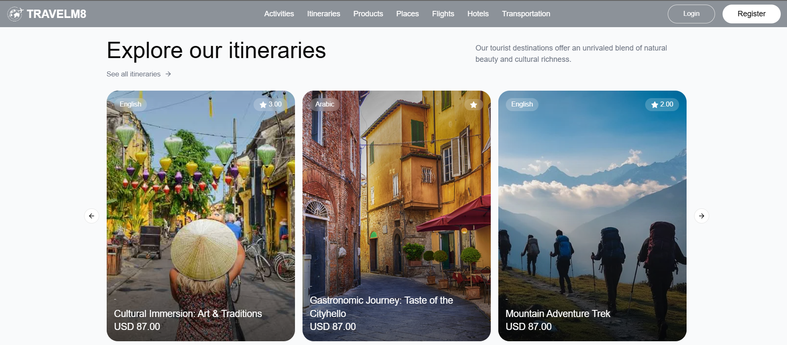
2. 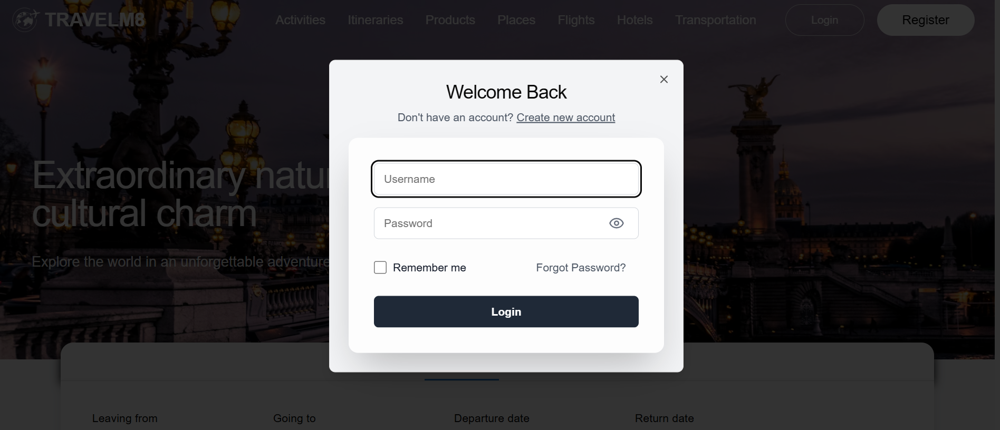
2. 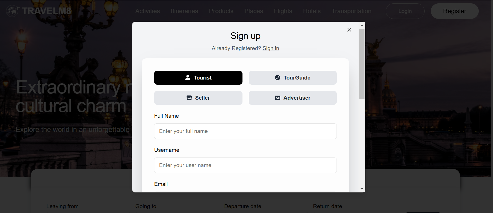
6. 
6. 
6. 
6. 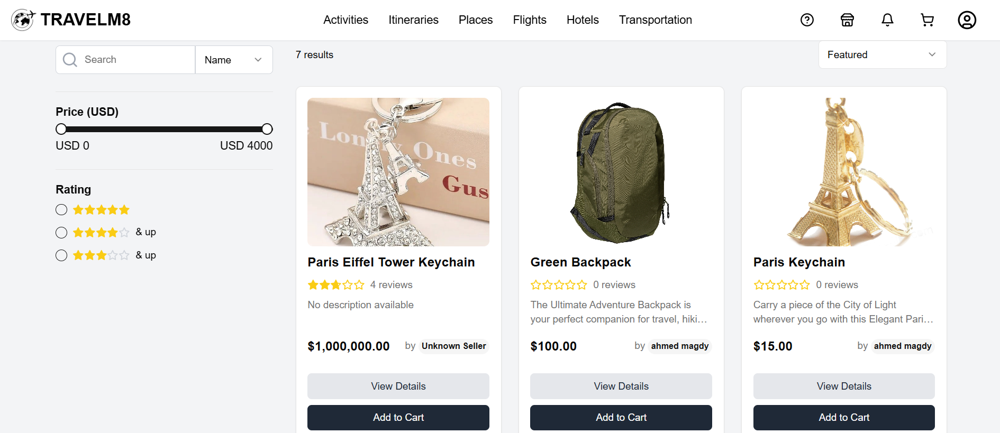
6. 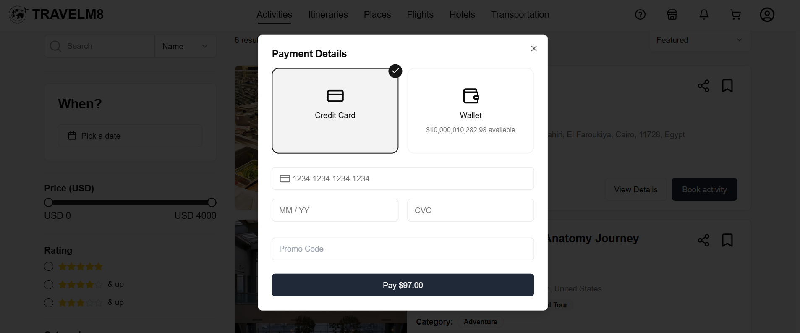
6. 
6. 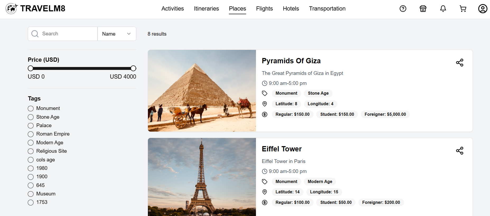
6. 
6. 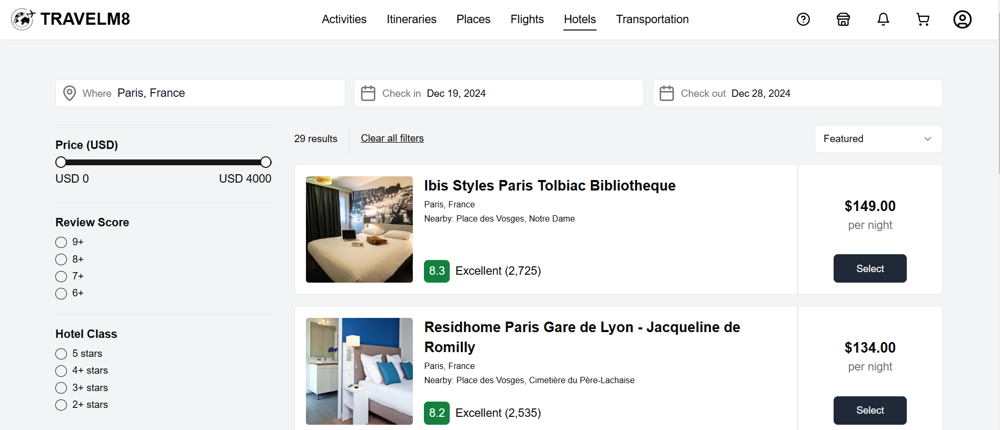
6. 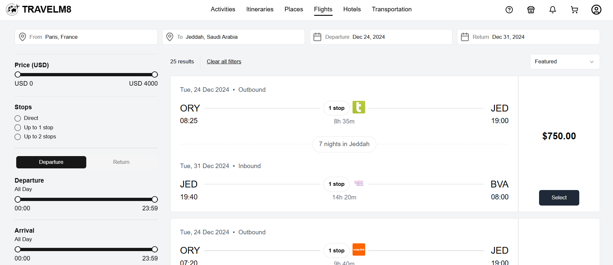
6. 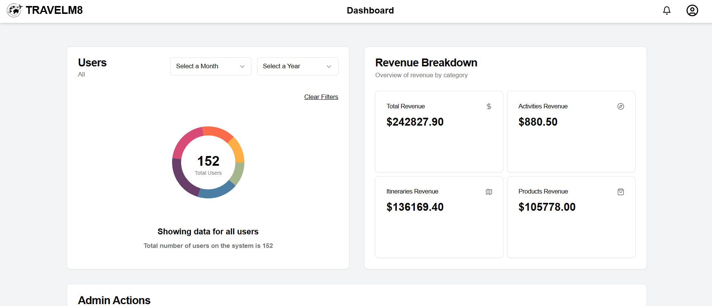
6. 
6. 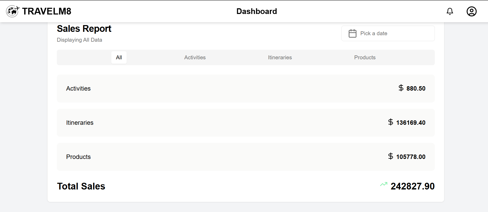
6. 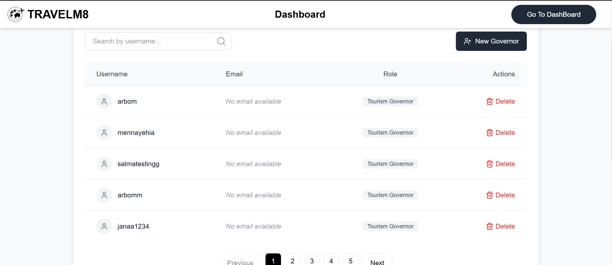
6. 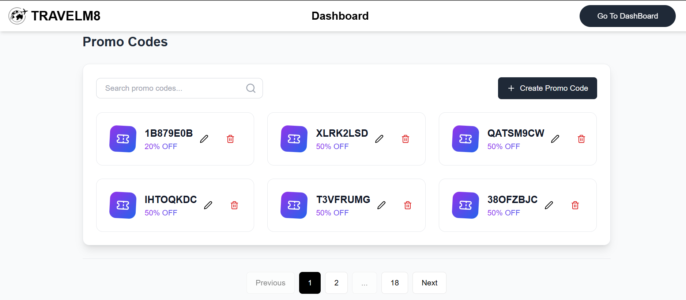


## Tech/ Framework Used

The technologies, libraries, and frameworks used in the project, categorized based on their purpose:

- Frontend
  -- React.js: JavaScript library for building user interfaces. Used to create a dynamic and interactive user experience for managing promo codes.
  -- Lucide-React: Icon library used for adding visually appealing icons like Plus, Search, Edit, and Trash.
  -- Toastify/Toast Component: Provides notifications for actions like creating or deleting promo codes, enhancing user feedback.
  -- Custom UI Components:
  -- Dialog: Used for creating modals (e.g., the Create Promo Code dialog).
  Button, Input, Label: Styled UI components for consistent and clean design.
- Backend
  -- Node.js: runtime environment for executing JavaScript code on the server.
  -- Express.js: Web framework used for building RESTful APIs for CRUD operations on promo codes.
- Database
  -- MongoDB Cloud (Atlas): NoSQL database used for storing promo code data, ensuring flexibility and scalability.
- API and Data Handling
  -- Axios: A promise-based HTTP client for making API requests to the backend.
  -- RESTful API: For consistent, scalable, and resource-oriented API design.
- Utilities
  -- ESLint: For enforcing consistent code style and catching errors early.
  -- Prettier: To ensure that all contributors follow a consistent formatting style.

## Features

In this project, what makes it stand out is its seemingless usage and design to make it user-friendly is that, for example, once the user signs up and accesses his/her account for the first time, guidance steps are distinguished as a simple and helpful walkthrough of the webpage, showcasing what each component on the webpage is for (search boxes and sorting options for instance). We have also used shadcn to enhance the UI.

## Code Examples

Illustrating the central functionality of our project and how it addresses the needs of users, one of the first and the most vital utility is user authentication/login.

1. Users enter their username and password into input fields.Upon clicking the Login button, the form triggers the handleSubmit function, which sends the username and password to the authentication API endpoint. The server returns a JWT token upon successful authentication, which is stored in localStorage for maintaining the session. Based on the user's role (e.g., Tourist, Admin, or Advertiser), the application redirects them to the appropriate dashboard or page.If the login fails, a user-friendly error message is displayed, describing the issue.

```sh
const { token, role, needsPreferences } = response.data;
localStorage.setItem('token', token);

const decodedToken = jwtDecode(token);
const userId = decodedToken.id || decodedToken.userId;

console.log("User ID:", userId);
localStorage.setItem('userId', userId);

console.log("Login successful. Role:", role);
console.log("token:", token);
console.log("pref: ", needsPreferences);

    switch (role) {
      case 'Tourist':
        navigate('/tourist-page');
        break;
      case 'Seller':
        navigate('/Sellerdashboard');
        break;
      case 'TourGuide':
        navigate('/tourGuideDashboard');
        break;
      case 'TourismGovernor':
        navigate('/TourismGovernorDashboard');
        break;
      case 'Admin':
        navigate('/AdminDashboard');
        break;
      case 'Advertiser':
        navigate('/advertiserDashboard');
        break;
    }
} catch (error) {
  setErrorMessage(error.response?.data?.msg || "Login failed. Please try again.");
}
};
```

2. User (if tourist), is trying to book an activity/itinerary, activities that are available for booking and user can sort them based on various criteria such as relevance or rating and price currencies.

```sh
const fetchActivities = useDebouncedCallback(async () => {
    setLoading(true); // Set loading to true when starting the fetch
    const queryParams = new URLSearchParams(location.search);
    queryParams.set("currency", currency);
    queryParams.set("exchangeRate", exchangeRates[currency] || 1);

    try {
      const fetchedActivities = (
        await getActivities(`?${queryParams.toString()}`)
      ).filter((a) => a.isBookingOpen);
```

3. As for an admin user for example, they have the abibility to manage pending users (tourists,advertisers, tour guides) by approving or rejecting their requests to sign up on the website.

```sh
const handleReject = async (userId) => {
    try {
      const response = await fetch(
        `http://localhost:5001/api/pending-users-documents/${userId}`,
        {
          method: "DELETE",
          headers: { "Content-Type": "application/json" },
        }
      );

      if (response.ok) {
        setUserDocuments(
          userDocuments.filter((item) => item.user._id !== userId)
        );
        toast("User rejected");
      } else {
        throw new Error("Failed to delete the user and documents");
      }
    } catch (error) {
      console.error("Error rejecting user:", error);
      toast("There was an issue rejecting the user.");
    }
  };
  const handleApprove = async (userId) => {
    try {
      const response = await fetch(
        `http://localhost:5001/api/approve-user/${userId}`,
        {
          method: "PATCH",
          headers: { "Content-Type": "application/json" },
        } );
      if (response.ok) {
        setUserDocuments(
          userDocuments.filter((item) => item.user._id !== userId)
        );
        toast("User approved and moved to the main collection.");
      } else {
        throw new Error("Failed to approve the user");
      }
    } catch (error) {
      console.error("Error approving user:", error);
      toast("There was an issue approving the user.");
    }
  };
```

4.  As for advertiser, a new activity can be created by adding its necessary fields; title, description, date, address, price, category,etc.

```sh
response = await fetch("http://localhost:5001/api/activities", {
         method: "POST",
         headers: {
           "Content-Type": "application/json",
           Authorization: `Bearer ${token}`
         },
         body: JSON.stringify(formData),
       });
     }
```

## Installation

Follow these steps to install and set up the **TravelM8** project on your local machine:

#### Prerequisites

Ensure you have the following installed on your system:

- [Node.js](https://nodejs.org/) (v16 or later)
- [MongoDB](https://www.mongodb.com/) (v5.0 or later)

### Steps to Install

1. **Clone the Repository**:
   Clone the repository from GitHub to your local machine:
   git clone https://github.com/Advanced-computer-lab-2024/TravelM8.git
   cd travelm8
   Install Dependencies: Install the necessary dependencies for both the backend and frontend:

#### Navigate to the backend folder and install dependencies

cd backend
npm install

#### Navigate to the frontend folder and install dependencies

cd ../frontend
npm install
_after installing the dependencies_
**Run the backend development server:**
cd backend
nodemon server.js

**Run the frontend development server:**
cd frontend
npm run dev

Access the Application:
Open your browser and go to http://localhost:5173 to view the frontend.
The backend API will be available at http://localhost:5001.

## API References

| Method | Route | Description.

- | GET, POST | /api/placetag | Fetch or create place tags.
- | POST, GET, PUT, DELETE | /api/activity-categories | Manage activity categories.
- | POST | /api/admins/register | Register a new admin user
- | DELETE | /api/users | Delete a user account.
- | GET | /api/getallusers | Retrieve all users.
- | GET | /api/admins | Get a list of all admins
- | POST | /api/admins/changepassword | Allow admins to change their password.
- | GET | /api/pending-user-documents | View pending user document submissions.
- | GET | /api/Allrequests | Fetch all deletion requests.
- | GET | /api/usersReport | Fetch users reports
- | DELETE | /api/usersOnly | Delete a user account without affecting related data.
- | POST, GET, PUT, DELETE | /api/preference-tags | Manage user preference tags
- | POST, GET | /api/tourism-governors | Add or fetch tourism governors.
- | POST | /api/tourism-governors/changepassword | Change the password for a tourism governor.
- | GET, POST | /api/activities | Retrieve a list of activities or create a new activity
- | GET, PUT, DELETE | /api/activities/:id | Retrieve, update, or delete a specific activity by its ID
- | GET | /api/myActivities | Retrieve activities associated with the logged-in user
- | PUT | /api/activities/:id/flag | Flag a specific activity as inappropriate
- | GET | /api/activities2 | Retrieve a different filtered or categorized list of activities
- | PUT | /api/activities/:id/unflag | Unflag a specific activity that was previously flagged as inappropriate
- | POST, GET | /api/advertisers | Create a new advertiser account or fetch a list of advertisers
- | PUT | /api/advertisers/updateMyProfile | Update the profile information of the logged-in advertiser
- | GET | /api/advertisers/myProfile | Retrieve the profile information of the logged-in advertiser
- | POST | /api/advertisers/changepassword | Change the password for an advertiser account
- | POST, GET | /api/sellers | Create a new seller account or fetch a list of sellers
- | PUT | /api/sellers/updateMyProfile | Update the profile information of the logged-in seller
- | GET | /api/sellers/myProfile | Retrieve the profile information of the logged-in seller
- | POST | /api/sellers/changepassword | Change the password for a seller account
- | POST, GET | /api/tourguides | Create a new tour guide or fetch a list of all tour guides.
- | PUT | /api/tourguides/updateMyProfile | Update the profile details of the logged-in tour guide.
- | GET | /api/tourguides/myProfile | Retrieve the profile details of the logged-in tour guide
- | POST | /api/tourguides/changepassword | Change the password for a tour guide account
- | POST, GET | /api/tourists | Register a new tourist or fetch a list of all tourists
- | PUT | /api/tourists/updateMyProfile | Update the profile details of the logged-in tourist
- | GET | /api/tourists/myProfile | Retrieve the profile details of the logged-in tourist
- | POST | /api/tourists/changepassword | Change the password for a tourist account
- | PUT | /api/updatePoints | Update the loyalty points of a user
- | PUT | /api/redeemPoints | Redeem loyalty points for rewards or discounts
- | PUT | /api/tourists/updatePreferences | Update the preferences of a tourist
- | GET | /api/tourists/preferences | Retrieve the preferences of the logged-in tourist
- | POST, DELETE, PUT | /api/tourists/cart/:productId | Add, remove, or update the quantity of a product in the tourist's cart..
- | DELETE | /api/tourists/cart/decrementItem/:productId | Decrease the quantity of a product in the tourist's cart
- | DELETE | /api/tourists/cart/clear | Clear all items from the tourist's cart
- | GET | /api/tourists/cart | Retrieve the contents of the tourist's cart.
- | GET, POST, DELETE | /api/tourists/wishlist | Add, remove, or fetch items in the tourist's wishlist
- | GET | /api/tourists/addresses | Retrieve the addresses associated with the logged-in tourist
- | POST, GET | /api/complaints | Create a new complaint or fetch all complaints
- | GET | /api/complaints/myComplaints | Retrieve complaints submitted by the logged-in user
- | PUT | /api/complaints/reply/:id | Add or update a reply to a specific complaint by its ID
- | POST, GET | /api/products | Create a new product or fetch a list of products
- | DELETE, PUT | /api/products/:id | Delete or update a specific product by its ID
- | PUT | /api/products/:id/archive | Archive a product to temporarily disable it
- | PUT | /api/products/:id/unarchive | Unarchive a product to make it active again
- | GET | /api/products/myProducts | Retrieve a list of products associated with the logged-in user.
- | POST | /api/products/pay-with-stripe | Make a payment for a product using Stripe
- | POST | /api/products/pay-with-cash | Record a cash payment for a product
- | GET | /api/getPlace/:id | Retrieve details of a specific place by its ID
- | GET | /api/getMyGovernor | Retrieve details about the governor associated with the logged-in user’s historical places
- | POST | /api/addPlace | Add a new historical place.
- | GET | /api/getAllPlaces | Retrieve a list of all historical places
- | PUT | /api/updatePlace/:id | Update details of a specific historical place by its ID
- | DELETE | /api/deletePlace/:id | Delete a specific historical place by its ID
- | PUT | /api/createTag/:id | Create or associate tags for a specific place or item by its ID
- | GET | /api/filterbyTags | Retrieve items or places filtered by specific tags
- | GET | /api/myPlaces | Retrieve all historical places associated with the logged-in user
- | POST, GET | /api/itineraries | Create a new itinerary or retrieve all available itineraries
- | PUT, DELETE, GET | /api/itineraries/:id | Update, delete, or get details of a specific itinerary by its ID.
- | GET | /api/myItineraries | Retrieve all itineraries created by the logged-in user
- | GET | /api/FilterItineraries | Retrieve itineraries based on specific filter criteria
- | GET | /api/searchItineraries | Search for itineraries using keywords or specific parameters
- | PUT | /api/itineraries/:id/flag | Flag a specific itinerary as inappropriate
- | POST | /api/itineraries/rate | Submit a rating for a specific itinerary
- | GET | /api/sales-report | Generate a sales report for itineraries or related bookings
- | POST | /api/itineraries/:id/notify-flag | Notify the owner of an itinerary that it has been flagged.
- | PUT | /api/itineraries/:id/unflag | Unflag a previously flagged itinerary.
- | GET, POST | /api/pending-users | Retrieve a list of pending user accounts or create a new pending user
- | PATCH, DELETE | /api/pending-users/:id | Approve or delete a specific pending user by his ID.
- | DELETE | /api/pending-users-documents/:id | Delete the documents associated with a specific pending user by ID
- | PATCH | /api/approve-user/:id | Approve a specific pending user account by its ID
- | POST, GET | /api/ratings | Submit or retrieve ratings for specific activities or products
- | POST | /api/auth/login | Authenticate a user
- | POST | /api/logout | Log out the user
- | POST | /api/upload-files | Upload required documents for sellers or advertisers
- | POST | /api/upload-files2 | Upload required documents for tour guides
- | GET | /api/getHotelsToken | retrieve hotels
- | POST | /api/getHotels | Search for available hotels using specified filters
- | POST | /api/purchases | Make a purchase of a product or itinerary
- | GET | /api/purchases/:touristId | Retrieve purchase history for a specific tourist by their ID.
- | DELETE | /api/purchases/:purchaseId | Cancel or delete a specific purchase by its ID.
- | GET | /api/purchasesReport | Fetch a report of all purchases
- | GET | /api/bookedactivities/completed/:touristId | Retrieve a list of completed activities for a specific tourist by their ID
- | POST, GET | /api/activity-bookings | Create a new activity booking or retrieve all activity bookings
- | PUT | /api/activity-bookings/:id | cancel a specific activity booking by it's id
- | GET | /api/activitiesReport | Generate a report of all activities
- | GET | /api/bookings/completed/:touristId | Retrieve a list of completed bookings for a specific tourist by their ID.
- | GET, POST | /api/itinerary-bookings | Retrieve all itinerary bookings or create a new itinerary booking
- | PUT | /api/itinerary-bookings/:id | cancel booking
- | GET | /api/itinerariesReport | Generate a report of all itineraries
- | POST | /api/products/pay-with-wallet | Make a payment for a product using wallet balance
- | POST | /api/create-payment-intent | Create a payment intent for processing payments
- | GET | /api/user/wallet-balance | Retrieve the wallet balance for the logged-in user.
- | POST | /api/tourists/checkout | Proceed to checkout with items in the cart
- | GET | /api/tourists/orders | Retrieve a list of all orders placed by the tourist
- | PUT | /api/tourists/orders/update-status/:id | Update the status of a specific order by its ID
- | PUT | /api/tourists/orders/cancel-order/:id | Cancel a specific order by its ID
- | GET | /api/ordersReport | retrieve a report of all orders
- | POST, GET | /api/bookmarks | Add or retrieve bookmarks for specific items
- | DELETE | /api/bookmarks/:id | Remove a specific bookmark by its ID.
- | POST | /api/deleteRequests | Submit a request to delete an account
- | DELETE | /api/delete-request | Delete a previously submitted account deletion request
- | GET, DELETE | /api/notifications | Retrieve or delete notifications for the logged-in user
- | PATCH | /api/notifications/:id/read | Mark a specific notification as read by its ID
- | DELETE | /api/notifications/:id | Delete a specific notification by its ID
- | POST | /api/auth/request-password-reset | Request a password reset for an account
- | POST | /api/auth/reset-password | Reset the password for an account
- | POST | /api/auth/verify-OTP | Verify an OTP (One-Time Password) for authentication
- | POST | /api/send-birthday-promo-codes | Send birthday promotional codes

This list provides a comprehensive overview of all available endpoints in the API, including the HTTP methods used for each endpoint and their respective paths.

## Tests

For TravelM8, we used Postman to manually test the API endpoints to ensure proper functionality and data flow between the backend and frontend. Below is an example of how we tested the GET route for fetching activities using Postman:
This section outlines how to use Postman to test our travel API, focusing on the /api/admins endpoint.

### Setting Up Postman

1. Download and install Postman from [https://www.postman.com/downloads/](https://www.postman.com/downloads/)
2. Launch Postman and create a new collection named "Travel API Tests"

### Testing the `/api/admins` Endpoint

##### 1. GET All Admins

- Method: GET
- URL: `http://localhost:5001/api/admins`
- Description: Retrieves a list of all admins

Steps:

1. Create a new request in your "Travel API Tests" collection
2. Set the request method to GET
3. Enter the URL: `http://localhost:5001/api/admins`
4. Click "Send" to execute the request
5. Verify that the response status is 200 OK
6. Check that the response body contains an array of admin objects containing a unique id and name for every admin

##### 2. Delete activity

- Method: DELETE
- URL: `http://localhost:5001/api/activities/:id`
- Description: Delete an activity

1. Create a new request in your Postman collection
2. Set the request method to DELETE
3. Enter the URL: `http://localhost:5001/api/activities/{activityId}` (replace `{activityId}` with an actual activity ID)
4. Click "Send" to execute the request
5. Verify that the response status is 200 OK
6. Check that the response body contains a success message and the details of the deleted activity

Example response:

```sh
{
  "message": "Activity deleted successfully",
  "deletedActivity": {
    "id": 1,
    "name": "Hiking",
    "description": "A scenic mountain hike",
    "price": 25.00,
    "duration": 180,
    "location": "Mountain Trail"
    }
}
```

Note: If the activity with the specified ID is not found, you will receive a 404 Not Found status.

##### 3. Create a New PlaceTag (POST)

- Method: POST
- URL: `http://localhost:5001/api/placetag`
- Description: Creates a new place tag

Steps:

1. Create a new request in your "Travel API Tests" collection
2. Set the request method to POST
3. Enter the URL: `http://localhost:5001/api/placetag`
4. Go to the "Body" tab, select "raw" and choose "JSON" from the dropdown
5. Enter the following JSON in the request body:
   ```json
   {
     "type": "Monument",
     "historicalPeriod": "Renaissance"
   }
   ```
6. Click "Send" to execute the request
7. Verify that the response status is 200 OK
   The provided link

A comprehensive Postman collection containing some of the tests we conducted for APIs is available https://www.postman.com/travelm8/workspace/malak-salma/collection/38567298-a8eb462b-c9d2-47ea-89f7-9294c632a99d?action=share&creator=38567298

## How to Use?

- If you're a new user, click the "Sign Up" button and fill in the required details to create an account.
- Existing users can log in by entering their username and password
- _For Tourguides_:
  1- Dashboard Access:

  - After logging in, navigate to your Tour Guide Dashboard to view key insights.
  - Navigate to itineraries tab to Access and manage your created itineraries, including editing,deleting them or archiving/unarchiving them.
  - Navigate to Sales Report tab so that you can View Sales Reports to monitor earnings from itineraries.
  - Navigate to Tourist Report tab so that you can View Tourist Reports for insights into audience preferences and engagement.
  - Check the Notification Bell Icon to Stay informed about important update, changes or announcemets related to your itineraries

  2-Profile Management:

  - Navigate to profile icon in the navigation bar and clicking on edit profile you can:
    - Navigate to Account info tab so that you can Update your profile information to keep your store details accurate and up-to-date.
    - Navigate to Security and Settings tab to Change your password so that you can maintain account security.
    - Navigate to Delete My Account tab so that you can Submit a request to delete your account.

- _For Advertisers_:
  1-Dashboard Access:

  - After logging in, navigate to your Advertiser Dashboard to access and manage key features:
  - Navigate to activities tab to Manage your created activities, including editing or removing them as needed.
  - Navigate to Sales Report tab so that you can View Sales Reports to monitor earnings from advertisements and activities.
  - Navigate to Tourist Report tab so that you can View Tourist Reports for insights into audience preferences and engagement.
  - Check the Notification Bell Icon to Stay informed about important update, changes or announcemets related to your activities.

  2-Profile Management:

  - Navigate to profile icon in the navigation bar and clicking on edit profile you can:
    - Navigate to Account info tab so that you can Update your profile information to keep your store details accurate and up-to-date.
    - Navigate to Security and Settings tab to Change your password so that you can maintain account security.
    - Navigate to Delete My Account tab so that you can Submit a request to delete your account.

- _For Seller_
  1-Dashboard Access:
  - After logging in, navigate to your Seller Dashboard to access and manage key features:
  - Navigate to products tab you can Manage your listed products, including editing, removing products and archiving/unarchiving products .
  - Navigate to SalesReport tab View Sales Reports to track earnings from product sales.
  - Check the Notification Bell Icon to Stay informed about important updates, promotions, or changes related to your products.
  2-Profile Management:
  - On clicking on the profile icon in the navigation bar and clicking on edit profile you can:
  - Navigate to Account info tab so that you can Update your profile information to keep your store details accurate and up-to-date.
  - Navigate to Security and Settings tab to Change your password so that you can maintain account security.
  - Navigate to Delete My Account tab to Submit a request to delete your account.
- _For Admin_
  1- Dashboard Access:

  - After logging in, navigate to your Admin Dashboard to access and manage key features:
  - Navigate to the Users card that displays the number of users and their types (tourists, advertisers, sellers,tour guides, tourism governers) which can also be filtered according to year and month selection.
  - Navigate/ analyze precise numercial values of revenues (activities, itineraries, products).
  - Navigate to Pending Users, where the you can reject or approve new users who registered to join your system.
  - Navigate to Users to view, edit, or delete existing user accounts.
  - Navigate to Account Deletion Requests to review and manage users who have requested account deletion.
  - Navigate to Admins to add or manage adminstrations of the system.
  - Navigate to Tourism Governors to assign or manage tourism governors in the system.
  - Navigate to Activities to create, update, or remove activities in the system.
  - Navigate to Itineraries to review and manage itineraries.
  - Navigate to Activity Categories to organize and manage categories for activities.
  - Navigate to Preference Tags to set up and manage tags for user preferences.
  - Navigate to Products to manage available products that are for sale or rent.
  - Navigate to Complaints to handle and resolve user complaints.
  - Navigate to Promo Codes to create, edit, search, or delete promo codes in the system.

    2-Profile Management:

    - Click on Change Password so you can enter your old and confirm your new password.
    - Click on the bell icon to display your notifications.

- _For Tourist_
  1- Dashboard Access
  - Tourists can enhance their experience by using various features within the Activities tab. They can bookmark activities by clicking on the bookmark icon, saving them to their Wishlist for later access. To stay informed about any changes or updates, tourists can click on the Notify Me button to receive alerts, such as availability or time adjustments. Additionally, they can seamlessly book activities by clicking the Book Activity button, filling in the required details, and confirming their booking for a hassle-free planning experience
  - Tourists can enhance their experience by using various features within the itineraries tab. They can bookmark itineraries by clicking on the bookmark icon, saving them to their Wishlist for later access. To stay informed about any changes or updates, tourists can click on the Notify Me button to receive alerts, such as availability or time adjustments. Additionally, they can seamlessly book itineraries by clicking the Book button, filling in the required details, and confirming their booking for a hassle-free planning experience
  - In the Products section, tourists can explore a wide range of items available for purchase. They can click on the View Details button to access detailed information about each product, including its pricing , seller of the product and review and comments about it. If they decide to purchase a product, they can conveniently add it to their cart by clicking the Add to Cart button, streamlining their shopping experience for a smooth checkout process.
  - In the Places section, tourists can browse through various locations and view essential details such as the price and associated tags that categorize the place. This allows users to quickly assess the historical places and their attributes without additional navigation
  - The Flights feature allows tourists to search for and compare various flight options tailored to their needs. By entering your departure location, destination, and travel dates, you can quickly find relevant flight options. Use filters such as price range, the number of stops, and departure or arrival times to narrow down your choices. Once you've reviewed the flight details, including duration, stops, and price, you can proceed to book your preferred flight by clicking the "Select" button.
  - The Hotels section enables tourists to explore and book accommodations with ease. Start by entering your destination along with check-in and check-out dates to browse available hotels. You can further refine your search by applying filters such as price range or hotel ratings. Detailed information about each hotel, including its features, nearby landmarks, and nightly rates, is available for your review. When you find a hotel that meets your needs, simply click "Select" to proceed with booking your stay.
  - The Transportation section simplifies booking rides for your travels. Begin by entering your pickup location, destination, and preferred pickup time. You can choose from a variety of transportation providers, such as Uber, Careem, and others, based on your preferences. Once you’ve selected a provider, finalize your booking by clicking the "Book Now" button, ensuring a smooth and convenient ride for your journey.
  - In the Products section, tourists can explore a wide range of items available for purchase. Browse through the collection, view product details, and check specifications and pricing. If you find something you like, you can easily add it to your cart by clicking the "Add to Cart" button. This ensures a seamless shopping experience during your trip planning process
  - The Notifications feature, represented by the bell icon on the dashboard, allows tourists to stay informed about important alerts. By clicking on the notification bell, you can access updates and critical information relevant to your travel plans
  - By clicking on the cart icon, tourists can view all the items they have added before proceeding to checkout, providing a convenient way to review their selections
  2-Profile Management
  - By clicking on the My Profile section, tourists can manage their account effectively through various features. They can view and edit their personal details under Account Info, check all past and upcoming Bookings, and track their Orders. Users can also review and redeem their accumulated Loyalty Points, submit and monitor Complaints, and update their Security & Settings, such as changing passwords. Additionally, users have the option to request account deletion through the Delete My Account feature, ensuring their data is removed after approval. This profile section provides a comprehensive overview and management of their account and activities on the platform
  - The Wishlist section allows users to view all the products and items they have liked and saved for future reference
  - The Bookmarks section allows users to keep track of their favorite activities and itineraries. By bookmarking these items, users can easily revisit them without searching again
  - When you click on the Preferences section, you are presented with an interface to select your travel preferences. This includes options like nightlife, nature, museums, historical landmarks, sports, and more

## Contribute

We welcome contributions to improve **TravelM8**! Whether you’re fixing bugs, adding features, enhancing the documentation, or optimizing code, your input is highly valued.

### How to Contribute

1. **Fork the Repository**:

   - Click the "Fork" button at the top of this repository to create your own copy.

2. **Clone Your Fork**:

   - Clone your fork to your local machine:
     ```sh
     git clone https://github.com/Advanced-computer-lab-2024/TravelM8.git
     cd travelm8
     ```

3. **Create a New Branch**:

   - Create a branch for your feature or fix:
     ```sh
     git checkout -b travelm8-contribute
     ```

4. **Make Your Changes**:

   - Make the necessary changes in your branch.
   - Follow the project’s coding style and conventions.

5. **Run Tests**:

   - Ensure that all changes pass existing tests and add new tests if applicable.
   - Use Postman to validate API endpoints or run unit tests if Jest is used.

6. **Commit Your Changes**:

   - Write a clear and descriptive commit message:
     ```sh
     git add .
     git commit -m "Fix: Corrected activity endpoint response"
     ```

7. **Push to Your Fork**:

   - Push your branch to your GitHub fork:
     ```sh
     git push origin feature-or-bugfix-name
     ```

8. **Submit a Pull Request**:
   - Open a pull request to the main repository, describing your changes and linking to any related issues.

### Reporting Bugs or Requesting Features

- **Bugs**: Open an issue and include details such as steps to reproduce the bug, screenshots, and error messages.
- **Features**: Submit a feature request by opening an issue and explaining why it would benefit the project.

---

We appreciate your contributions!

## Credits

This project was made possible with the help and inspiration of numerous open-source projects, tutorials, and resources. We are grateful to the following:
Open Source Libraries:

- [node.js] : evented I/O for the backend
- [Express] : fast node.js network app framework [@tjholowaychuk]
- [Stripe] : For enabling secure payment integration
- [Shadcn] : A modern, customizable component library built with TailwindCSS for accessible designs.
  Tutorials and Videos: -[Set Up Payments with Nodejs and Stripe] - [Accept Payments Using Stripe] : For a clear and practical guide to integrating Stripe payments. -[Nodejs Crash Course Tutorial] - [Express Crash Course] : A comprehensive introduction to building REST APIs with Node.js and Express. -[React Axios] : A promise-based HTTP client for making API requests. -[Folders Structuring of Mern Project]: A guide to organizing and structuring folders effectively in a MERN stack project for better scalability and maintainability -[Mern Stack Tutorial] : A step-by-step guide to building MERN stack applications, combining React, Node.js, Express, and MongoDB.

## License

This project is licensed under a dual-license model. You may choose to use the project under either the MIT License or the Apache License 2.0, depending on your needs. For example, if you are integrating payment functionality using Stripe, which is licensed under Apache 2.0, you can choose the Apache License for compatibility. On the other hand, if your use case aligns with projects like React, which uses the MIT License, you can opt for the MIT License. For the full text of both licenses, see the LICENSE file in this repository.

[//]: # "These are reference links used in the body of this note and get stripped out when the markdown processor does its job. There is no need to format nicely because it shouldn't be seen. Thanks SO - http://stackoverflow.com/questions/4823468/store-comments-in-markdown-syntax"
[node.js]: http://nodejs.org
[express]: http://expressjs.com
[stripe]: https://youtu.be/1r-F3FIONl8
[shadcn]: https://ui.shadcn.com/
[Set Up Payments with Nodejs and Stripe]: https://www.youtube.com/watch?v=mI_-1tbIXQI&t=2130s&pp=ygUVc3RyaXBlIHBheW1lbnQgbm9kZWpz
[Accept Payments Using Stripe]: https://www.youtube.com/watch?v=1r-F3FIONl8&t=2s&pp=ygUVc3RyaXBlIHBheW1lbnQgbm9kZWpz
[Nodejs Crash Course Tutorial]: https://www.youtube.com/watch?v=zb3Qk8SG5Ms&list=PL4cUxeGkcC9jsz4LDYc6kv3ymONOKxwBU
[React Axios]: https://www.youtube.com/watch?v=12l6lkW6JhE&t=29s&pp=ygULcmVhY3QgYXhpb3M%3D
[Mern Stack Tutorial]: https://www.youtube.com/watch?v=O3BUHwfHf84&t=9s&pp=ygUSbWVybiBzdGFjayBkZXBsb3kg
[Folders Structuring of Mern Project]: https://www.youtube.com/watch?v=R9GZx_MYuV8&t=29s&pp=ygUqaG93IHRvIHN0cnVjdHVyZSBhIGZvbGRlcnMgb2YgbWVybiBwcm9qZWN0
[Express Crash Course]: https://youtu.be/CnH3kAXSrmU
